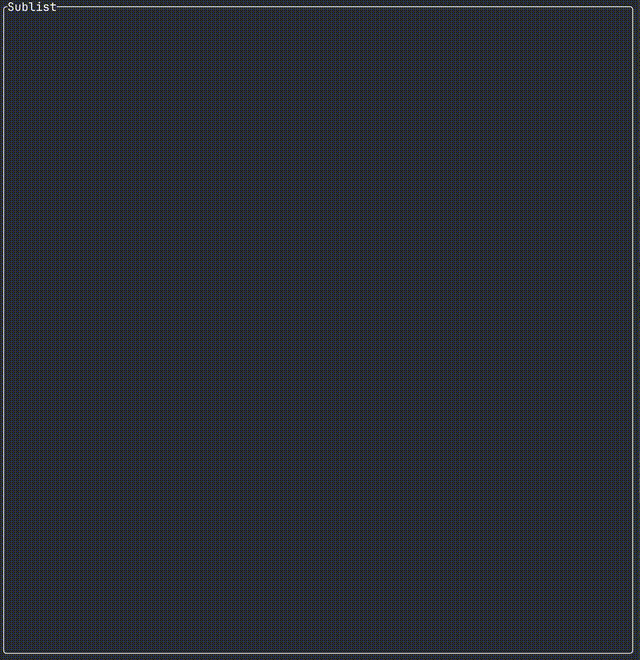

# ngored

A **terminal Reddit client** built as a side project.  
It’s **not stable yet**, but already **usable** if you like living on the edge.  

> ⚠️ Expect bugs, crashes, and sharp corners. ngored is still evolving.  

---

## 📸 Demo



---

## ✨ Features

- Browse Reddit posts right from your terminal  
- Navigate comments and threads in a clean TUI  
- Fast and keyboard-driven  
- Lightweight (no Electron here 👀)  

---

## 🚧 Status

ngored is a **work-in-progress** passion project.  
Things may change quickly, and some features are incomplete.  

Still, if you enjoy hacking in the terminal, you might already find it fun.  

---

## 🛠 Installation

Clone and build with Rust:

```bash
git clone https://github.com/yourusername/ngored.git
cd ngored
cargo build --release
```

Run it:

```bash
./target/release/ngored
```

---

## 🤝 Contributing

While ngored started as a personal side project, feedback and contributions are welcome:  

- 🐞 Report bugs  
- ✨ Suggest features  
- 🔧 Send PRs  
- ⭐ Star the repo if you like it!  

---

## 📜 License

MIT  
